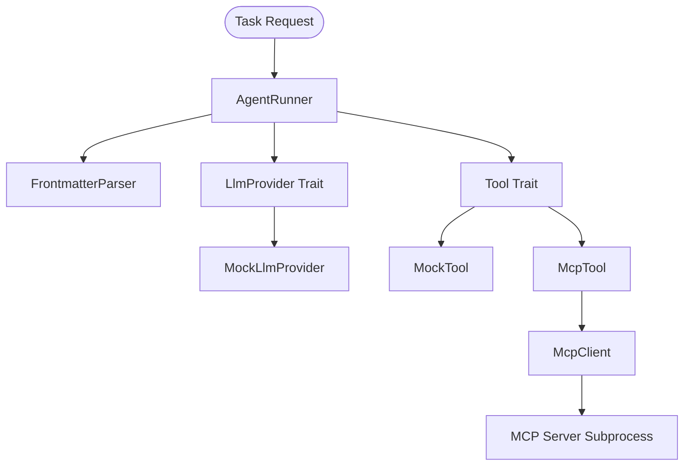

# Agent MCP Runtime


**Note**: This project is currently under active development and may undergo significant changes.

> 
> 
> 
> 

## Part of the AI Skill Ecosystem

This repo is one of 6 in a composable AI skill ecosystem:

| Repo | Role |
|------|------|
| [`ruby-core-skills`](https://github.com/igmarin/ruby-core-skills) | 15 shared Ruby skills + process discipline |
| [`rails-agent-skills`](https://github.com/igmarin/rails-agent-skills) | 28 Rails-specific skills + 9 agents |
| [`hanakai-yaku`](https://github.com/igmarin/hanakai-yaku) | 35 Hanami/dry-rb skills + 10 agents |
| [`agnostic-planning-skills`](https://github.com/igmarin/agnostic-planning-skills) | 10 planning skills + 4 agents |
| [**`agent-mcp-runtime`**](https://github.com/igmarin/agent-mcp-runtime) | Rust CLI runtime (pack resolution, MCP) |
| [`ruby-skill-bench`](https://github.com/igmarin/ruby-skill-bench) | Benchmark/eval engine |

See the [Ecosystem Overview](docs/ecosystem.md) for the full architecture.

## Key Features

- **Strict Compile-Time Safety**: Zero unsafe code permitted (`unsafe_code = "deny"`) and strict workspace linting gates.
- **Asynchronous ReAct Runner**: Orchestrates reasoning and action loops using customizable LLM providers via a factory service (`LlmProviderFactory`).
- **Model Context Protocol (MCP) Client**: Integrates external tools by spawning long-running subprocesses and exchanging JSON-RPC 2.0 messages over stdout/stdin with isolated stream runners.
- **Dynamic Context Merging**: Connects to dynamic context provider tools (MCP HTTP) and maps outputs to database, routes, controller, or model context tiers in a framework-agnostic manner.
- **Mockable Skill Pack Caching**: Employs git resolvers (`SkillSourceResolver`) backed by a mockable `GitRunner` interface for fully offline, fast testing and safe error cleanup.
- **TDD Frontmatter Parser**: Parses Markdown frontmatter to extract metadata for agent skills/tools.
- **GitHub Actions CI/CD**: Automatic code formatting, strict clippy checks, test suites, and vulnerability scanning (`rustsec/audit-check`).

## Architecture



For detailed information about the system and ecosystem, refer to the following documentation:

- 🏗️ **[Ecosystem Overview](docs/ecosystem.md)**: Architecture map and repository interaction logic.
- 🚀 **[Migration Guide](docs/migration-guide.md)**: Reorganization details, list of moved/new skills, and code migration steps.
- 📐 **[System Architecture](docs/architecture.md)**: Deep dive into the ReAct loop engine, traits, and subprocess client.
- 🤖 **[Agent Guidelines](AGENT.md)**: Instructions, strict constraints, and contribution history for AI agents.
- ♊ **[Gemini Integration](GEMINI.md)**: Gemini setup, model recommendations, and JSON payload structures.
- 🛡️ **[Security Policy](SECURITY.md)**: Vulnerability reporting, memory safety configuration, and dependency audits.
- 🏁 **[Getting Started](docs/getting_started.md)**: Prerequisites, building steps, and unit testing guidelines.

## Installation

### Quick Install (Recommended)

No dependencies required — download a pre-built binary for your platform:

```bash
curl -fsSL https://raw.githubusercontent.com/igmarin/agent-mcp-runtime/main/install.sh | bash
```

The script automatically detects your OS and architecture, downloads the correct binary, and installs it to `~/.local/bin`.

### Alternative Methods

**Manual download** — grab a binary from [GitHub Releases](https://github.com/igmarin/agent-mcp-runtime/releases) and place it in your PATH.

**From source** — if you have Rust installed:

```bash
cargo install agent-mcp-runtime
```

### Verify Installation

```bash
agent-mcp-runtime --version
```

## Getting Started

### Prerequisites

Ensure you have Rust (stable 1.74+) installed (only required for building from source).

### Building and Testing

Check out [docs/getting_started.md](docs/getting_started.md) for more details.

1. **Verify Formatting**

   ```bash
   cargo fmt --check
   ```

2. **Run Lints & Clippy**

   ```bash
   cargo clippy --all-targets -- -D warnings
   ```

3. **Run Test Suite**

   ```bash
   cargo test
   ```

## Repository Health

We practice strict repository hygiene. Every commit is audited in GitHub Actions CI for formatting, clippy warnings, tests correctness, and dependency security audits via Cargo Audit.
