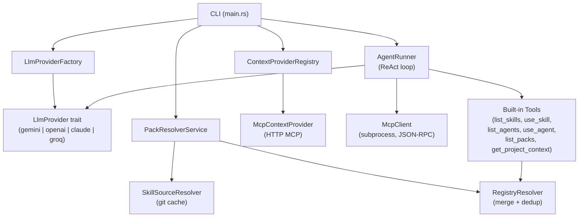
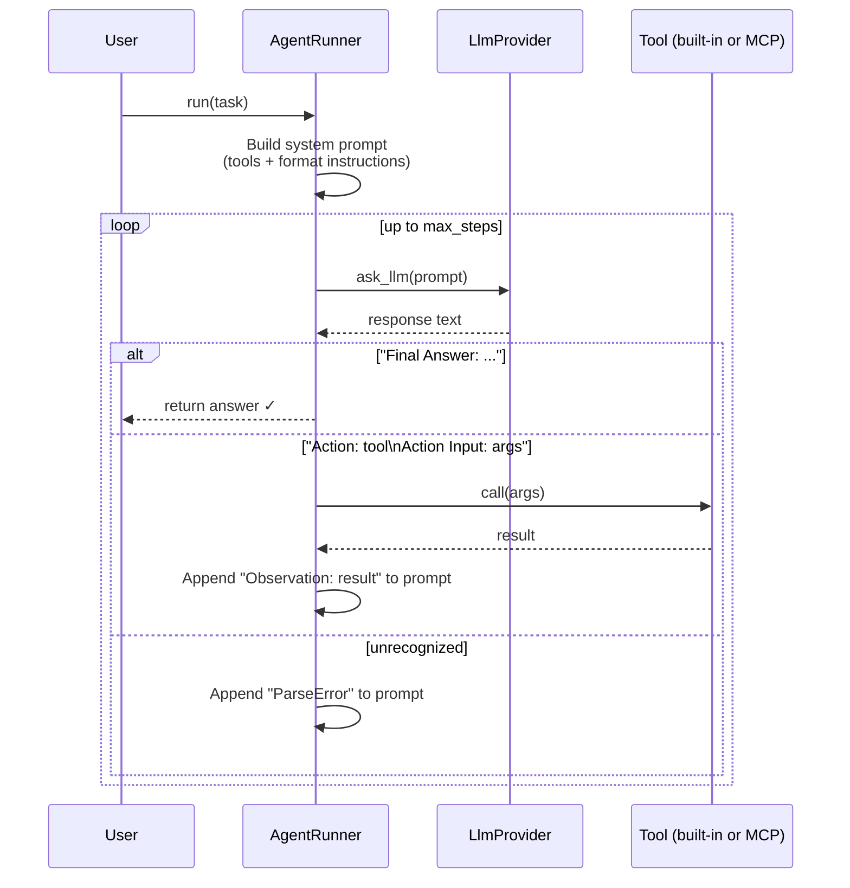
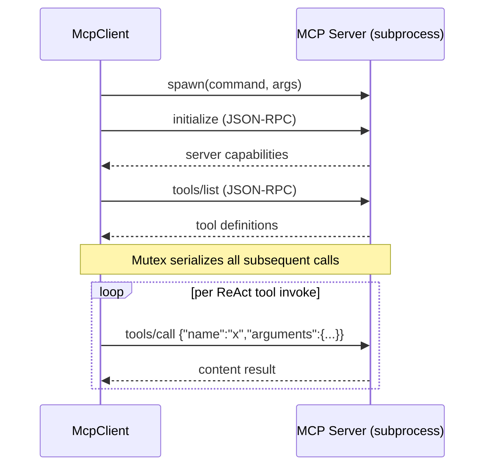
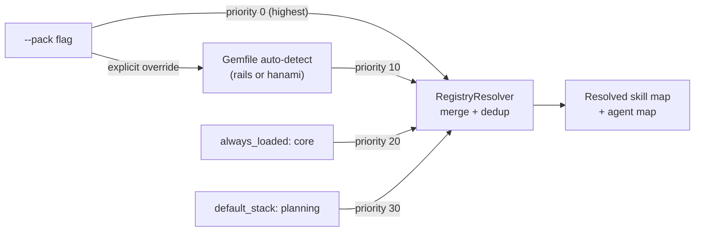
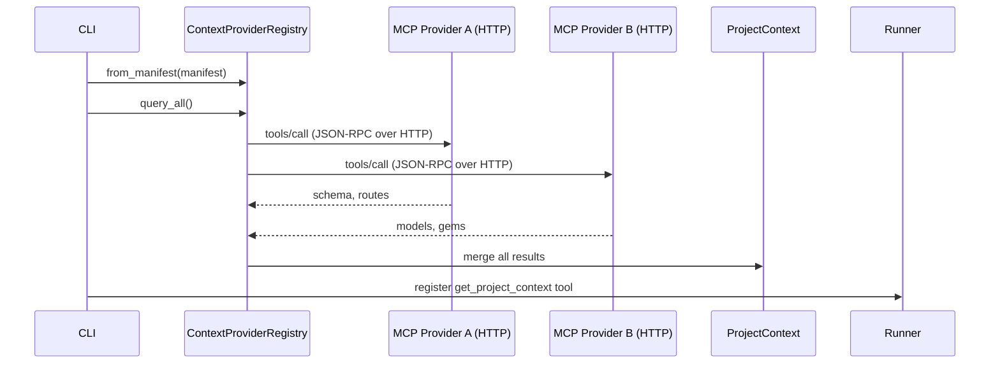
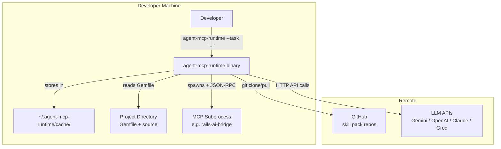
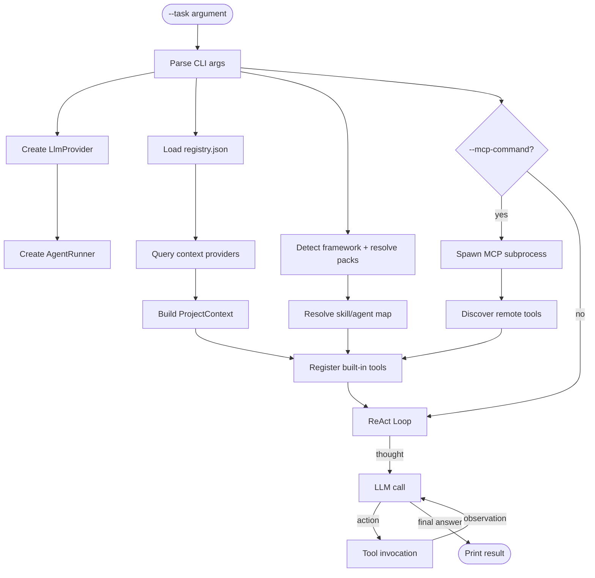

# Design: Agent MCP Runtime

- **Status**: Draft
- **Slug**: `agent-mcp-runtime-core`

## Summary

`agent-mcp-runtime` is a Rust CLI that composes AI agent skills from distributed GitHub packs into a single execution session. It uses a ReAct (Reason + Acting) loop powered by pluggable LLM providers and exposes tools to the agent via the Model Context Protocol (MCP). The runtime auto-detects the host project's framework, resolves skills with layered priorities, caches skill packs via git, and merges external project context from HTTP MCP providers.

## Context and Scope

This project is the **runtime** in a 6-repository AI skill ecosystem. Four skill packs (`ruby-core-skills`, `rails-agent-skills`, `hanakai-yaku`, `agnostic-planning-skills`) provide Markdown-based skill definitions and agent workflows. A fifth repo (`ruby-skill-bench`) benchmarks them. This runtime is the orchestrator — the CLI binary that a developer runs to execute AI agent tasks that draw on those skills.

The problem: skills and tools live in separate repos, each potentially targeting different frameworks, with overlapping names and versioned deprecations. The runtime must compose them, resolve conflicts, auto-detect the relevant ones, and expose them to an LLM that reasons about which to use.

This document covers the **core architectural decisions**: the execution model, tool abstraction, skill distribution protocol, pack resolution, and context merging. It does not cover the contents of individual skill packs or the benchmark engine.

## Goals

- **Composable**: Load and merge skills from multiple independently-versioned repos.
- **LLM-agnostic**: Work with Gemini, OpenAI, Claude, and Groq behind a single interface.
- **Framework-aware**: Auto-detect Rails or Hanami from a project's `Gemfile` to load the right packs.
- **Offline-testable**: All I/O paths (git, LLM, MCP subprocesses) are behind mockable traits so tests run without network.
- **Memory-safe**: Deny all unsafe Rust; rely on compiler-enforced safety.
- **Operator-friendly**: Single binary with no runtime dependencies beyond `git`.

## Non-Goals

- **Skill authoring**: The runtime does not create, validate, or edit skill files. Skill packs are authored externally.
- **Agent memory across sessions**: Each invocation is stateless beyond what the LLM retains in context.
- **Multi-agent orchestration**: The runtime runs one ReAct loop with one LLM at a time.
- **Tool sandboxing beyond process boundaries**: MCP servers run as subprocesses; the runtime does not containerize them.
- **Streaming responses**: The runtime waits for complete LLM responses before acting.

## Constraints

| Constraint | Detail |
|---|---|
| **Language** | Rust stable 1.74+, edition 2021 |
| **Async runtime** | Tokio (multi-threaded) |
| **LLM transport** | HTTP (reqwest), JSON request/response |
| **MCP transport** | JSON-RPC 2.0 over stdin/stdout pipes |
| **Skill storage** | Git repositories, cached to `~/.agent-mcp-runtime/cache/` |
| **Manifest format** | `registry.json` (local), `tile.json` (per pack) |
| **Fallback LLM** | `gemini-1.5-flash` (free-tier friendly, fast) |
| **Safety** | `unsafe_code = "deny"`, strict clippy gates, no `.unwrap()` in non-test code |

## Proposed Design

### Component Architecture



### ReAct Execution Loop

The `AgentRunner` is the core engine. It follows the ReAct pattern: the LLM alternates between producing an **action** (a tool call) and receiving an **observation** (the tool result), terminating with a **final answer**.



Key properties:
- **Step ceiling** (default: 5) prevents infinite loops and runaway LLM costs.
- **Stateless**: each `run()` builds a fresh prompt. All "memory" is the accumulated conversation context appended in the loop.
- **Deterministic parsing**: `parse_react_step` looks for exact `Action:` / `Action Input:` / `Final Answer:` tokens. Ambiguous output triggers a `ParseError` feedback loop.

### Tool Abstraction

Everything the agent can invoke implements the `Tool` trait:

```
trait Tool: Send + Sync {
    fn name(&self) -> &str;
    fn description(&self) -> &str;
    async fn call(&self, input: &str) -> Result<String, Error>;
}
```

This single trait covers three categories:

| Category | Examples | Registered how |
|---|---|---|
| **Built-in skill tools** | `list_skills`, `use_skill`, `list_agents`, `use_agent`, `list_packs` | Hard-coded in `register_tools()`, backed by `RegistryResolver` |
| **Project context** | `get_project_context` | Backed by `ProjectContext` (merged from HTTP MCP providers) |
| **Remote MCP tools** | Any tool exposed by a spawned MCP server | Discovered at startup via `McpClient.get_tools()`, wrapped in `McpTool` |

### MCP Client (Subprocess)

External tool capabilities come from spawning MCP servers. The runtime's `McpClient` manages one subprocess at a time:



Design choices:
- **stdin/stdout pipes** over HTTP: no port conflicts, works offline, simpler subprocess lifecycle.
- **Tokio `Mutex`** on request/response: guarantees JSON-RPC message ordering without ID collisions. Only one call is in-flight at a time; the ReAct loop is sequential anyway.
- **Long-lived process**: the subprocess stays alive for the full session. No per-call spawn overhead.
- **ID tracking**: each request gets a sequentially incremented JSON-RPC `id` to match responses.

### Pack Resolution and Loading

Skill packs are Git repositories with a `tile.json` manifest at the root. The runtime resolves which packs to load in a deterministic priority chain:



Rules:
1. **Local registry** (`--registry`) wins over everything — enables pack development.
2. **Framework packs** (detected from `Gemfile`) override `core` for same-named skills.
3. **`core`** is always loaded (provides shared Ruby skills).
4. **`default_stack`** (`planning`) loads unless excluded.
5. **Deprecation aliases**: a pack's `tile.json` can redirect old skill names to their replacements transparently.
6. **Dependencies validated**: missing `depends_on` packs trigger warnings but don't block execution.

The git cache layer (`SkillSourceResolver`) clones repos to `~/.agent-mcp-runtime/cache/` on first access and pulls updates on subsequent runs. The `GitRunner` trait allows mock injection for tests.

### Context Merging

Before the ReAct loop starts, the runtime queries external HTTP MCP providers (defined in `registry.json`) for project metadata — schema, routes, models, gems, config. Results are merged into a `ProjectContext` struct and exposed via `get_project_context`.



Providers are ordered alphabetically for deterministic merging. Each provider maps its tool names to `ProjectContext` fields via a configuration mapping. Missing providers are silently skipped.

### LLM Provider Factory

The `LlmProviderFactory` selects and constructs a provider based on the CLI `--provider` flag:

```
LlmProviderType (enum) → LlmProvider (trait)
  Gemini   → GeminiProvider   (GEMINI_API_KEY)
  OpenAI   → OpenAiProvider   (OPENAI_API_KEY)
  Claude   → ClaudeProvider   (ANTHROPIC_API_KEY)
  Groq     → GroqProvider     (GROQ_API_KEY)
```

Each provider implements `async fn ask_llm(&self, prompt: &str) -> Result<String>`. The factory reads the relevant environment variable, constructs the provider with model and optional base URL override, and returns it. This keeps provider selection explicit and auditable — no auto-detection or fallback chains.

## Architecture Views

### System Context



### Data Flow (Single Session)



## Interfaces and Data

### `registry.json` (runtime manifest)

Defines known skill packs and context providers. Each pack entry specifies a GitHub source (`owner/repo`), tile manifest path, load behavior (`always_loaded`), and dependencies (`depends_on`). The `default_stack` lists packs loaded unless overridden.

### `tile.json` (per-pack manifest)

Each skill pack repo contains a `tile.json` catalog:

```jsonc
{
  "name": "rails-agent-skills",
  "version": "1.0.0",
  "skills": {
    "write-tests": { "description": "...", "path": "skills/write-tests.md" }
  },
  "agents": {
    "tdd": { "description": "...", "path": "agents/tdd/AGENT.md" }
  },
  "deprecated_skills": {
    "write-yard-docs": "replaced_by: write-documentation"
  }
}
```

### Tool Trait

The single `Tool` trait (`src/registry/tool.rs:8`) is the contract for all agent-callable capabilities. Every tool returns a `name`, `description`, and an async `call` method accepting arbitrary string input and returning a string result.

### JSON-RPC 2.0 (MCP Wire Protocol)

The `McpClient` communicates with spawned MCP servers using `JsonRpcRequest { jsonrpc, id, method, params }` and `JsonRpcResponse { jsonrpc, id, result, error }` structs defined in `src/mcp/jsonrpc.rs`.

### LlmProvider Trait

The LLM abstraction (`src/providers/mod.rs`) is intentionally minimal — a single `ask_llm(prompt) -> Result<String>` method. The prompt is the accumulated ReAct conversation. No separate system/user/assistant message roles are exposed at this level; providers handle their own API-specific serialization internally.

## Alternatives Considered

### Embedded skill loading vs. Git-based distribution

**Considered**: Embedding skills at compile time via `include_str!` or shipping them in the binary.

**Rejected**: Skills change independently of the runtime. Embedding would require recompilation for every skill update and couples release cycles. Git-based distribution allows independent versioning, contributor workflows (PRs to skill packs), and cache freshness without recompilation.

### HTTP MCP vs. subprocess MCP for skills

**Considered**: Using HTTP MCP servers (the same pattern used for context providers) as the primary tool integration mechanism.

**Rejected**: Subprocess MCP has zero network overhead, no port management, and simpler lifecycle (spawn → communicate → kill on exit). HTTP MCP is retained for context providers where the data source may be remote or independently deployed.

### Plugin system via dynamic linking (cdylib)

**Considered**: Loading tools as `.so`/`.dylib` plugins for performance.

**Rejected**: Dynamic linking introduces unsafe code, platform-specific builds, and ABI stability concerns. The MCP subprocess model achieves similar isolation with a simpler, language-agnostic contract. LLM latency dominates anyway — tool call overhead is negligible.

### Agent-embedded tool descriptions vs. runtime-registered tools

**Considered**: Having the LLM discover tools by asking a `search_tools` endpoint on demand.

**Rejected**: Tool descriptions are included in the system prompt, which means the LLM sees the full catalog immediately. On-demand discovery adds round trips and risks the LLM never discovering relevant tools. All tools in the session are known and listed upfront.

### Streaming ReAct vs. batch ReAct

**Considered**: Streaming LLM responses and acting on partial output (e.g., parsing `Action:` mid-stream).

**Rejected**: Streaming parsing is fragile — partial JSON or truncated tool names would cause frequent parse errors. The batch approach is simpler, more debuggable, and ReAct steps are fast enough that streaming offers marginal UX improvement.

## Tradeoffs

| Gain | Give Up / Risk |
|---|---|
| Single binary, no runtime deps beyond `git` | Skills only updatable via git pull (no push-based refresh) |
| LLM-agnostic via thin trait | Can't use provider-specific features (e.g., function calling, structured output) |
| MCP subprocess for tool isolation | Process management overhead, zombie process risk on crash |
| Frontmatter in Markdown for skill metadata | No schema enforcement at parse time; malformed YAML is a runtime error |
| Deterministic pack priority merge | Adding a new priority tier requires code change |
| Offline tests via mock traits | Trait proliferation — every I/O boundary needs a trait |

## Cross-Cutting Concerns

### Security
- `unsafe_code = "deny"` at the compiler level prevents memory safety bugs.
- LLM API keys are read from environment variables only — never from config files, CLI args, or hard-coded strings.
- MCP subprocesses inherit the runtime's privileges. No sandboxing beyond the process boundary is provided.

### Observability
- `--verbose` flag enables detailed step logging (each ReAct iteration, tool invocations, LLM prompts).
- The `tracing` crate is integrated for structured, level-based diagnostics.
- Dependency validation warnings are printed to stderr on every run.

### Reliability
- Step ceiling prevents infinite loops and runaway costs.
- MCP subprocess errors propagate as tool results (not crashes).
- Context provider failures are silently skipped — the session proceeds without external context.
- Missing packs or unresolved dependencies produce warnings but do not block execution.

### Performance
- LLM API calls are the dominant latency source (seconds). Tool resolution and prompt building are negligible.
- Git cache avoids re-cloning on every run.
- Tokio's multi-threaded runtime allows concurrent context provider queries.

### Cost
- Default `gemini-1.5-flash` is free-tier friendly.
- Step ceiling caps maximum tokens per session.
- Git operations (clone/pull) use negligible bandwidth after first cache.

## Open Questions

1. **Push-based skill updates**: Should the runtime support a webhook or polling mechanism to refresh the cache without waiting for the next CLI invocation?
2. **Multi-MCP subprocesses**: Currently one MCP server is supported. Should the runtime spawn multiple servers that expose different tool sets?
3. **Skill validation at load time**: Should the runtime validate skill markdown structure (required sections, valid YAML frontmatter) at load time rather than at use time?
4. **Session persistence**: Should the ReAct loop support save/restore for long-running multi-step tasks that exceed the step ceiling?

## Decision

The `agent-mcp-runtime` runtime uses a **ReAct loop over pluggable LLM providers**, composes skills from **git-distributed packs resolved by deterministic priority merging**, and integrates external tools via **MCP subprocess clients over JSON-RPC stdin/stdout**. All I/O paths are behind **mockable traits** for offline testing. The binary compiles with **zero unsafe Rust** and ships as a single statically-linked executable.

This design prioritizes composability, testability, and operator simplicity over raw performance or provider-specific features.
